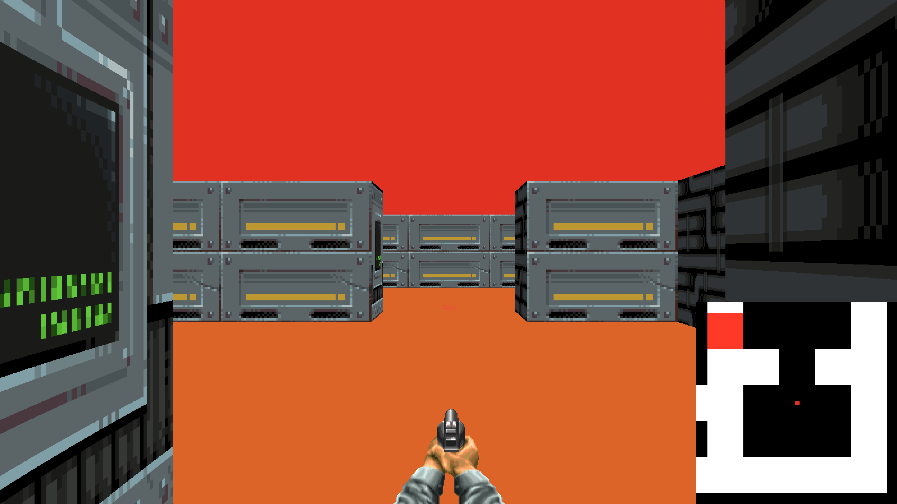
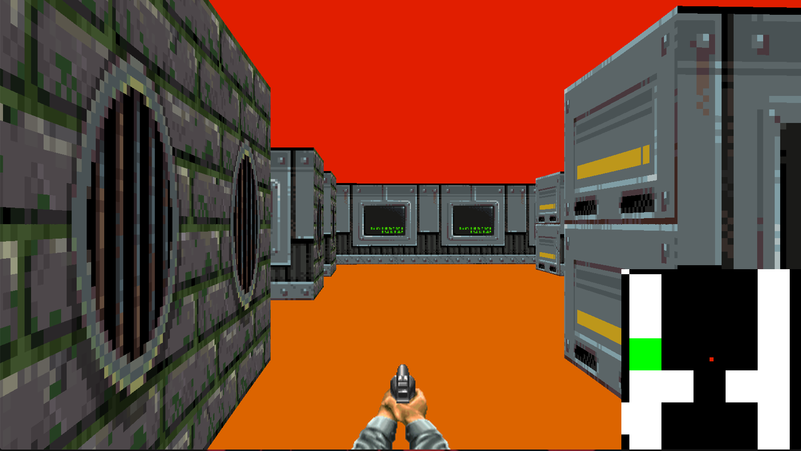
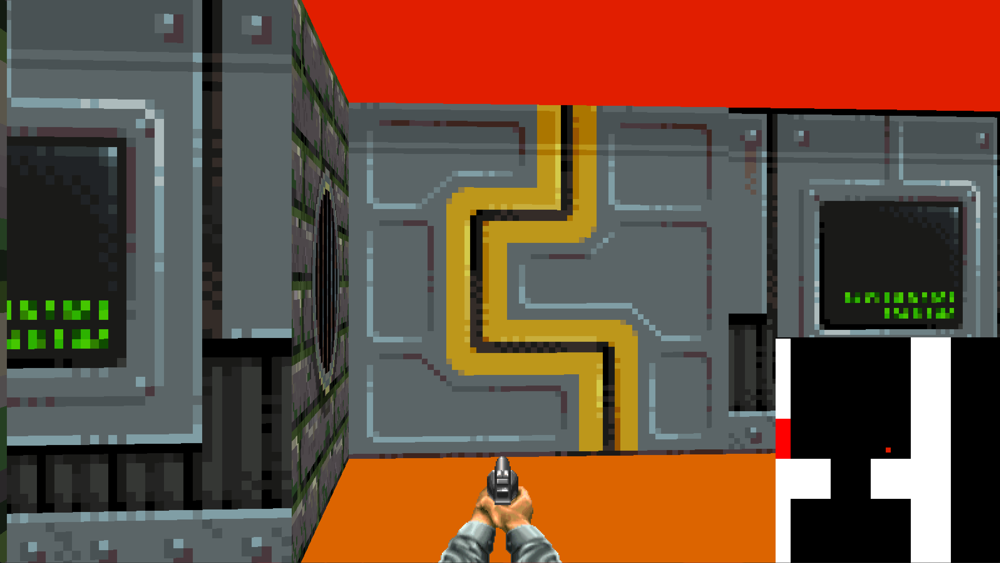

# Cub3d

Cub3d is a project inspired by the world-famous Wolfenstein 3D game, which was the first FPS ever. It allows you to explore ray-casting, a technique used in early video games to simulate 3D environments.

## Table of Contents
- [Introduction](#introduction)
- [Features](#features)
- [Installation](#installation)
- [Building on macOS](#building-on-macos)
- [Building on Linux](#building-on-linux)
- [Usage](#usage)
- [Controls](#controls)
- [Screenshots](#screenshots)

## Introduction

Cub3d is a graphics project that leverages ray-casting to create a 3D environment. It's a challenging and educational project that allows you to delve into the basics of computer graphics and game development. The project is implemented in C and utilizes the [MinilibX](https://github.com/codam-coding-college/MLX42.git) library for graphical rendering.

## Features

- Ray-casting rendering engine
- Textured walls
- Player movement and rotation
- Basic sprite rendering
- Map parsing from a configuration file
- Wall collisions and basic physics
- ...

## Installation

1. Clone the repository:

    ```bash
    git clone https://github.com/yel-hadr/cub3D_42.git
    ```

2. Navigate to the project directory:

	```bash
	cd cub3d
	```
3. build the project and the minilibx library:

	```bash
	make libmlx
	```

## Building on macOS

If you are on macOS, use the following command to build the project:

    ```
    make mac
    ```

## Building on Linux

If you are on Linux, use the following command to build the project:

	```
	make
	```

## Usage

1.Run the executable with a map configuration file as an argument:

in linux :

	```bash
	./cub3D maps/map.cub
	```

in mac :

	```bash
	./cub3D_mac maps/map.cub
	```

## Controls

- **W:** Move forward
- **A:** Move left
- **S:** Move backward
- **D:** Move right
- **Arrow keys:** Turn and rotate the view
- **Mouse movement:** Turn and rotate the view with the mouse
- **Esc:** Exit the game

## Screenshots







